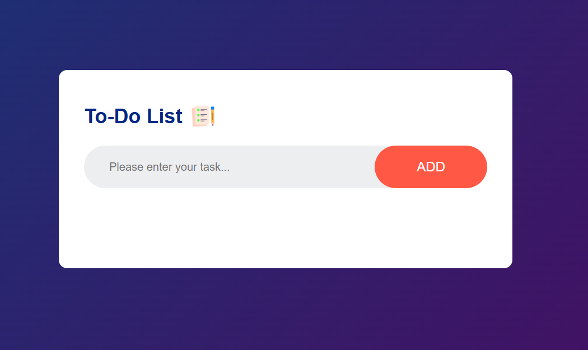

# 📝 To-Do List Application

A **simple and elegant to-do list web application** built using **vanilla HTML, CSS, and JavaScript**.  
This project helped me strengthen my understanding of **DOM manipulation**, **event handling**, and **browser localStorage** for data persistence.

---

## ✨ Features

### 🧩 Core Functionality
- ➕ Add new tasks with a single click  
- ✅ Mark tasks as completed with a visual checkmark  
- ❌ Delete tasks easily  
- 💾 Persistent storage — tasks are saved even after closing the browser  

### 🎨 Design
- 🌈 Modern gradient background  
- 📱 Fully responsive design that works on all devices  
- ⚡ Smooth animations and hover effects  
- 🧼 Clean and intuitive user interface  

---

## 🎥 Demo
*(Insert demo GIF or screenshot here)*  
> See the to-do list application in action!

---

## 💡 About This Project

I created this to-do list application as part of my **web development learning journey**.  
Through this project, I gained hands-on experience with:

- ✨ **JavaScript ES6** features and DOM manipulation  
- 🧱 **CSS Flexbox** for building responsive layouts  
- 💾 **Browser localStorage API** for saving data persistently  
- 🎯 **Event handling** and interactive UI patterns  

This was a great learning experience that taught me how to build **interactive web applications from scratch** — without relying on frameworks or libraries.

---

## 🚀 How to Run

1. Clone the repository:
   ```bash
   git clone https://github.com/yourusername/todo-list-app.git
   ```
2. Navigate to the project folder:
   ```bash
   cd todo-list-app
   ```
3. Open the `index.html` file in your browser.

That’s it! 🎉 You’re ready to start adding your tasks.

---

## 🛠️ Technologies Used
- **HTML5**  
- **CSS3 (Flexbox)**  
- **JavaScript (ES6)**  
- **localStorage**

---

## 📚 Lessons Learned
- How to manipulate the DOM dynamically  
- Storing and retrieving data using localStorage  
- Creating smooth UI interactions with pure CSS and JavaScript  
- Structuring small projects for scalability and readability  

---

## 📸 Screenshots
**

---

## 👨‍💻 Author
**Burcu AKSOY**  
🌐 [LinkedIn](www.linkedin.com/in/burcuaksoy-ch) | 🐙 [GitHub](https://github.com/burcuaksoy-ch)
